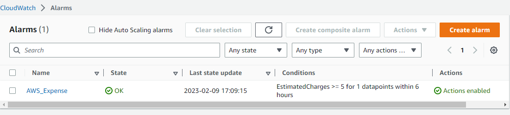
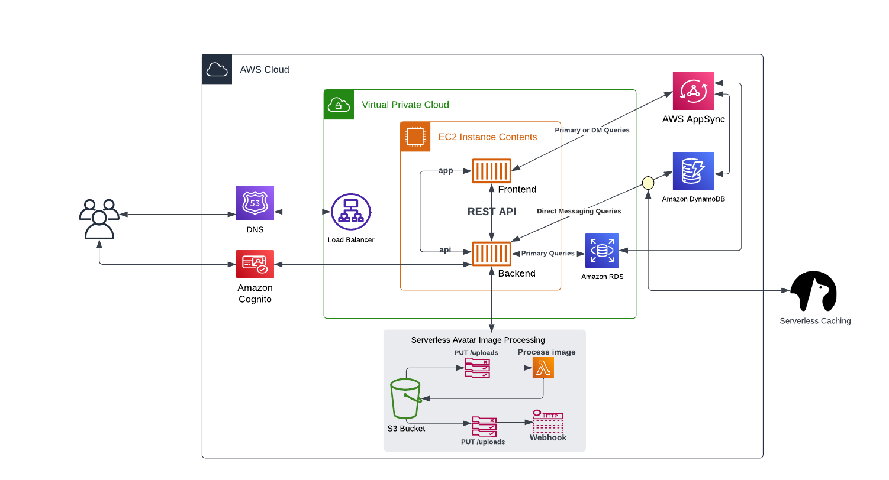

# Week 0 — Billing and Architecture

Yipeee :dancer: :dancer: :dancer:   the Free AWS Cloud Project Bootcamp officially kicked off this week.

I hoped to send this out earlier than now but this week tried it with me.

Let's get to it, shall we!!

## HouseKeeping 

This week at the bootcamp was called week 0.
Week 0 to me was essientially housekeeping week, although there were prerequisites that needed to get done before the commencement of the bootcamp there was still a lot to put in place to ensure readiness for the project.

The housekeeping tasks I completed this week are mentioned below:

:sparkles: -  ### Added a Virtual MFA Device to my AWS root account

Security is a very big consideration for me as I am in the cloud security space and so adding a virtual authentication device to my root account was one of the first steps I took after creating my AWS account. This is essential to provide an additional layer of protection to the account because a compromised AWS root account is the very worst thing that can happen to any organisation or even indiviual.

To do this I used the microsoft authenticator app as m virtual authenticator device.
This app and the codes were used to setup MFA, it's a pretty straight forward process and so I won't go into the details for the setup.

- ### Created a User with Admin Rights

Another security consideration is not to make use of your root account for daily use but to use it for those tasks that can be performed by only the root user. To be able to do this I created an IAM user and added the user to an admin user group I had created. 

This group was given AdministratorAccess. AdministratorAccess provides full access to AWS services and resources making the need to login to my AWS root account very little.

I also created access key for this user. This is necessary as I will use this access key to enable the AWS CLI to access my AWS account via the command line.

## Pricing Consideration

- ### Created Billing Alarm

I created a billing alarm to be able to track spend in AWS throughout the project. This is to ensure I do not go over the free tier limit and even if we do I am quickly alerted to that spend.

A billing alarm is created from cloudwatch
Cloudwatch alarms can be in either an "In alarm" state, an "ok" state or an "Insufficient" state.

The alarm was set to send an sns notification when the EstimatedCharges >= 5 for datapoints within 6 hours.

- #### Billing Alarm

- ### Created an AWS Budget

In addition to creating a billing alarm it is necessary to create a budget as billing alarms are limited compared to budgets. Billing alarm represents only the amount that has already been charged. Whereas a budget can alarm us based on forecasted charges, which would give us a bit of head up to figure out what's happening before we get hit with excess bill usage. 

I used the zero spend AWS budget template to create a budget that would alert me when my AWS spending exceeds $0.01 which is above the AWS Free Tier limits.

Ideally I would have also created a budget for credits as well to track and forcast the spending of what AWS credits I have but as at the time of writing this I have no AWS credit so that would wait till I do get my hands on some credit.

- #### AWS Budget

## Architectural Diagram

Using Lucid chart I recreated the Cruddur Architectural diagram.
Lucid chart is a very quick study and very semaless to use, even if I have used it's alternative draw.io in the past making the switch to lucid chart was quite easy.

With Lucid chart I recreated the logical diagram of the app this project is mostly based upon. In the coming weeks we will draw from this chart and piece all the parts together. This chart is hopefully clear enough for even nontechnical people to understand as it details the operational flow from user to database within the app.

Here is a picture of the chart and also the link to the actual chart I created.

- #### Lucid chart logical diagram

- #### Link to the chart
[Cruddur Architectural Diagram Link](https://lucid.app/lucidchart/12786108-6aad-4199-9d84-3b9eafda0bef/edit?view_items=tm6xBl9_h0hH&invitationId=inv_f35934e1-0b84-4e4a-b664-1e28c9322d98)