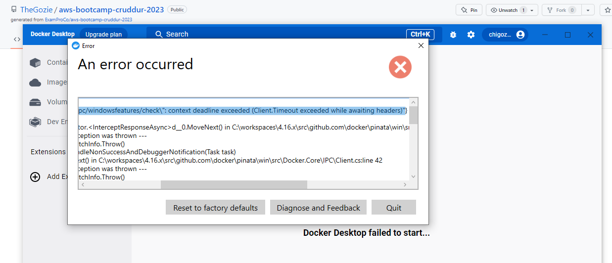

# Week 1 — App Containerization

## Installing Docker on my localmachine and Running the same Containers outside of Gitpod / Codespaces

I previously had docker desktop installed on my local machine which I had been using but I was prompted that an update was available and so I updated the app and that was when all m woes started. 

- #### Docker Desktop Update


After updating, docker desktop developed issues and kept failing to start, after multiple failed troubleshooting attempts I tried to uninsatlling, deleting the previous docker files and reinstalling docker desktop multiple times but I kept experiencing the same issue (screenshot below).

- #### Billing Alarm


After struggling with this error for a long while I decided to install Docker directly and do away with Docker desktop.

The below instructions was what I used.

```
curl -fsSL https://get.docker.com -o get-docker.sh
sudo sh get-docker.sh
sudo usermod -aG docker $USER
sudo update-alternatives --config iptables
```

These instructions were gotten from [here](https://nickjanetakis.com/blog/install-docker-in-wsl-2-without-docker-desktop#:~:text=Since%20we're%20installing%20Docker,Docker%20adds%20to%20WSL%202.)

With Docker installed I got to work of running the containers in my local machine.
