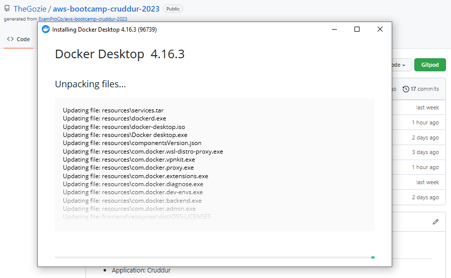
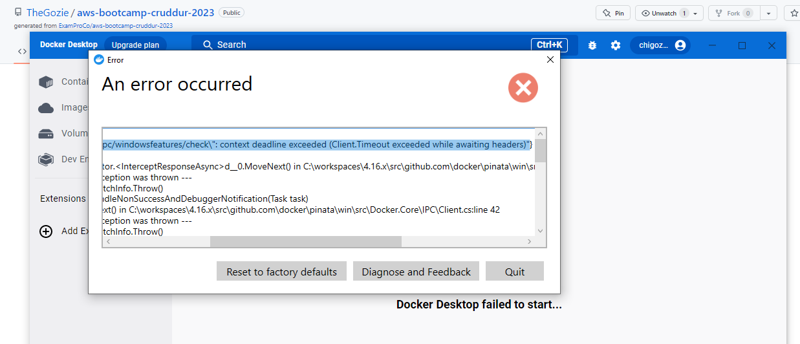
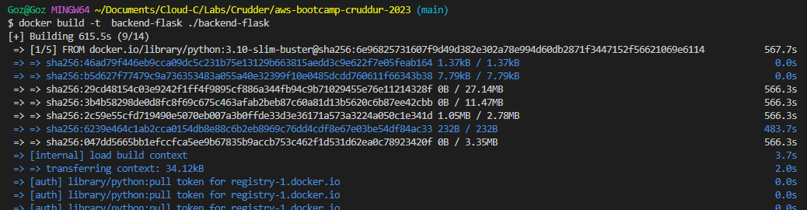
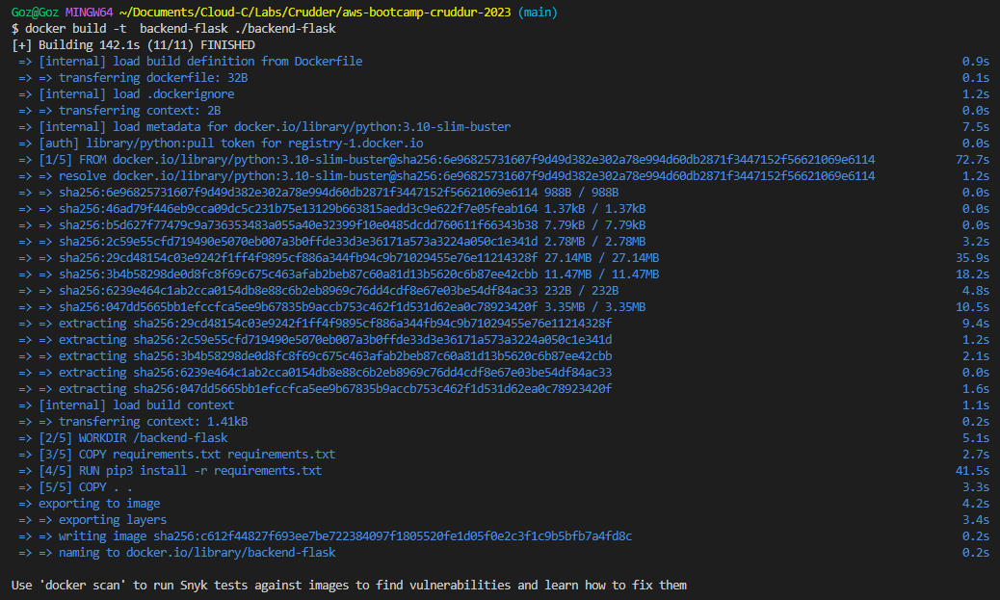
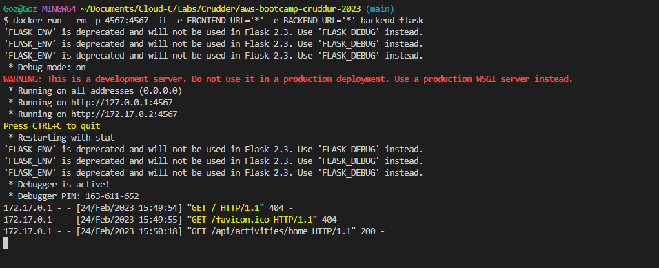
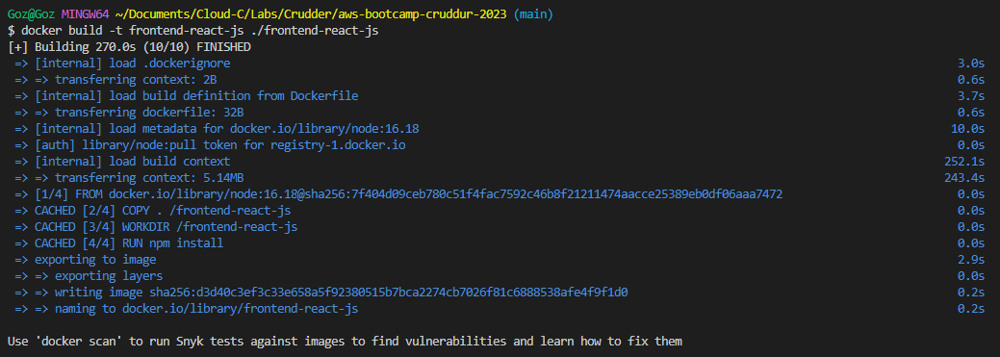
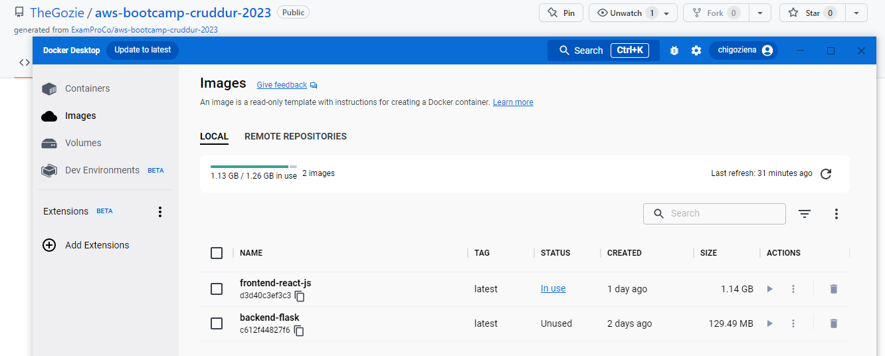
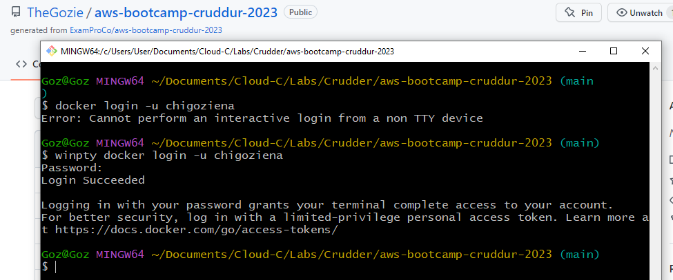

# Week 1 — App Containerization

## Installing Docker on my localmachine and Running the same Containers outside of Gitpod / Codespaces

## Installing Docker on my local machine

I previously had docker desktop installed on my local machine which I had been using but I was prompted that an update was available and so I updated the app and that was when all m woes started. 

- #### Docker Desktop Update


After updating, docker desktop developed issues and kept failing to start, after multiple failed troubleshooting attempts I tried to uninsatlling, deleting the previous docker files and reinstalling docker desktop multiple times but I kept experiencing the same issue (screenshot below).

- #### Docker Desktop Error


After struggling with this error for a long while I decided to install Docker directly and do away with Docker desktop.

The below instructions was what I used.

```
curl -fsSL https://get.docker.com -o get-docker.sh
sudo sh get-docker.sh
sudo usermod -aG docker $USER
sudo update-alternatives --config iptables
```

These instructions were gotten from [here](https://nickjanetakis.com/blog/install-docker-in-wsl-2-without-docker-desktop#:~:text=Since%20we're%20installing%20Docker,Docker%20adds%20to%20WSL%202.)

With Docker installed I got to work of running the containers in my local machine.

## Containerizing the Backend

The first step was to build the image but I could not build with the docker I had installed on my local machine, I kept getting told to download buildx so I went back and downloaded a previous version of Docker Desktop and after much ado it finally worked.

### Building the Backend Image

I created a Dockerfile in the backend duirectory on my local computer then ran the below code to build the image.

```
docker build -t  backend-flask ./backend-flask
```

- #### Screenshots of the image being built on my local machine





### Running the Backend Container

To run the backend container from the Backend image, I ran the code:

```
docker run --rm -p 4567:4567 -it -e FRONTEND_URL='*' -e BACKEND_URL='*' backend-flask
```
- #### The backend container running on my local machine




## Containerizing the Frontend

I created a Dockefile in the frontend directory and saved the configuration of the container.

### Building the Frontend Image

On trying to run npm Install before building the container because it is needed to copy the contents of node_modules I ran into an "npm: command not found error" message. To solve this problem I installed [node.js](https://nodejs.org/en/download/) on my local machine then reran `npm i`.

After this I was able to build the image by running 

```
docker build -t frontend-react-js ./frontend-react-js
```
Here's a screenshot I took of my Cli on completion of the image build and another screenshot of my Docker Desktop showing the images I have available on my local machine.

- #### Images available on my local machine (Docker Desktop)



### Running the Frontend Container

To run the image, the below code was run

```
docker run -p 3000:3000 -d frontend-react-js
```
While I was able to run the frontend container locally (on my local machine), it made my computer very slow to the point of it beung inoperable (I have a 4gb ram system). This issue did not allow me take a screenshot of the running container.

The errors I got as I tried to run the container include:

- "Failed to complie" : To solved this, I deleted the node_module folder and installed npm all over again.
- "React not defined" : To solve this I added the following line to the index.js file `window.React = React`. I found that this solved my problem.

## Pushing the Images to Docker Hub

To push the images to docker hub I needed to login to my Docker hub account through the Cli but i got the error "Error: Cannot perform an interactive login from a not TTY device" after troubleshooting I found out way to circumvent that is to add `winpty` at the beginning of my command (it enables TTY on Windows, useful for GitBash, Putty and MobaXTerm) and so the code read as shown below:

```
winpty docker login -u <myusername>
```

- #### Cli Docker Hub login



I decided to place both the Frontend image and the Backend image in the same repo, differentiating them with tags.

First i ran the `docker ps` command to check if I had any running containers.

To get the image ID I ran the `docker images` command. The image ID is necessary for tagging the image.

Next thing I did was to tag the image and finally pushing it to Docker Hub.

**To tag the image**
```
 docker tag c612f44827f6 chigoziena/cruddur:backend-flask
```

```
docker tag 0ec0b4e9d471 chigoziena/cruddur:frontend-react-js
```

**Pushing the image**

```
docker push chigoziena/cruddur:backend-flask
```

```
docker push chigoziena/cruddur:frontend-react-js
```

Pushing the frontend image was a very tough nut to crack, it took me roughly a whole day for it to complete pushing.

- ##### Backend


- #### Frontend


- #### Screenshot of Docker Hub repo Showing the Available Images.


## Implement a Healthcheck in the V3 Docker compose file

To implement a health check in the Docker compose file, I added the below code:

```
healthcheck:
  test: ["curl", "-f", "http://localhost"]
  interval: 1m30s
  timeout: 10s
  retries: 3
  start_period: 40s
```

Since this health check is based on curl I needed to ensure that curl is installed within the image used for running the service. so I also added the below line of code to the docker compose file:

```
RUN apk --update --no-cache add curl
```

